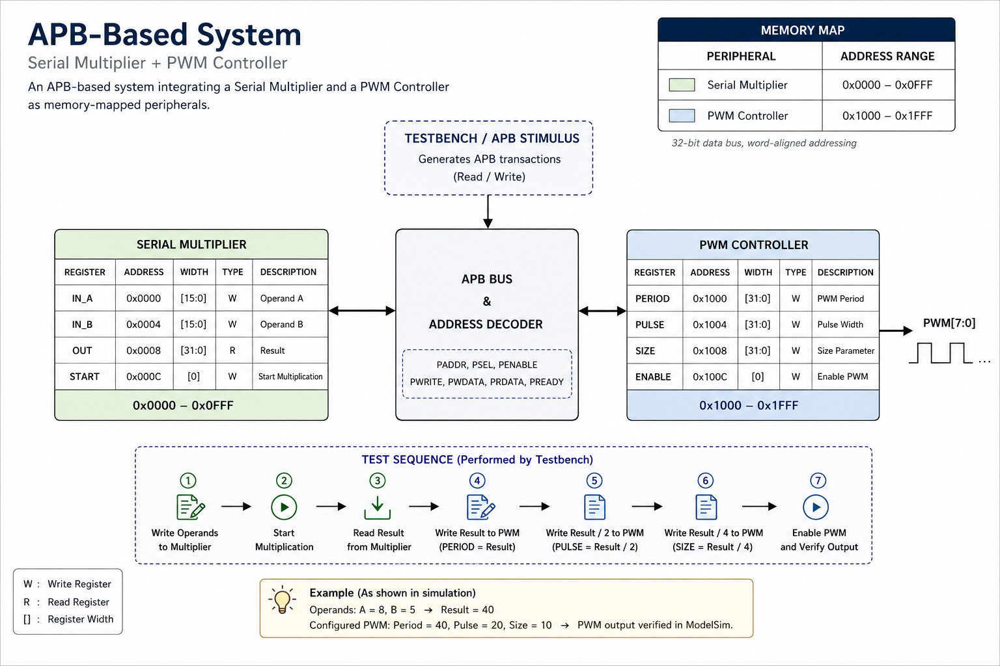
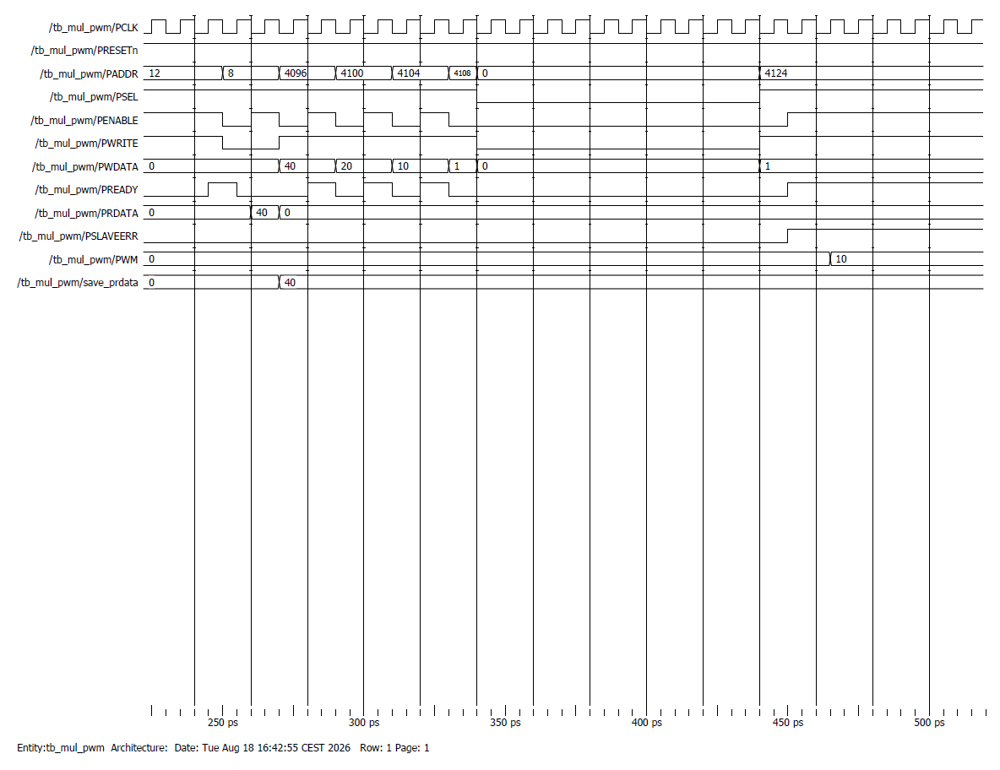
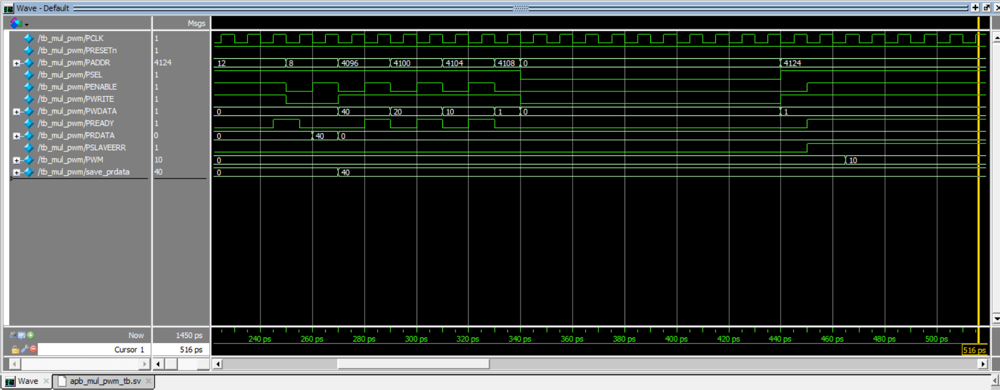

# APB-Based Multiplier and PWM System

SystemVerilog implementation and verification of an APB-based system integrating a serial multiplier and a PWM controller as memory-mapped peripherals.

## Overview

This project was developed as part of a Digital Systems Design course during my Master's studies in Electronic Engineering at the University of Bologna.

The system consists of two peripherals connected through an APB-based interconnect:

- Serial Multiplier
- PWM Controller

The multiplier receives two operands through APB transactions and produces a 32-bit result. The result is then read through the APB interface and used by the testbench to configure the PWM controller.

## System Architecture



The address space is divided between the two peripherals:

| Peripheral | Address Range |
|---|---|
| Serial Multiplier | `0x0000 – 0x0FFF` |
| PWM Controller | `0x1000 – 0x1FFF` |

## Operation

The verification flow performs the following sequence:

1. Write two operands to the serial multiplier.
2. Start the multiplication.
3. Wait for the multiplier result to become available.
4. Read the result through APB.
5. Configure the PWM controller using:
   - Period = Result
   - Pulse = Result / 2
   - Size = Result / 4
6. Enable the PWM controller.
7. Verify the resulting PWM output.

For the simulation shown below:

`8 × 5 = 40`

The resulting PWM configuration is therefore:

- Period = 40
- Pulse = 20
- Size = 10

## Simulation

The complete system was simulated and verified using ModelSim.




The waveform shows the APB transactions, multiplier result (`PRDATA = 40`), the stored result, subsequent PWM configuration transactions, and the resulting PWM output.

## Project Structure

```text
├── src/
│   ├── apb_mul_pwm.sv
│   ├── apb_mul_wrap.sv
│   ├── apb_node.sv
│   ├── apb_node_include.sv
│   ├── apb_node_wrap.sv
│   ├── apb_pwm.sv
│   ├── apb_pwm_wrap.sv
│   └── mul_serial.sv
│
├── tb/
│   └── apb_mul_pwm_tb.sv
│
├── docs/
│   └── pwm.png
│
└── simulation/
    ├── modelsim_waveform.png
    └── modelsim_waveform1.png


## Tools

- SystemVerilog
- ModelSim
- APB (Advanced Peripheral Bus)

## Key Concepts

- Memory-mapped peripherals
- APB read/write transactions
- Address decoding
- Serial multiplication
- PWM generation
- RTL module integration
- Testbench-based verification
